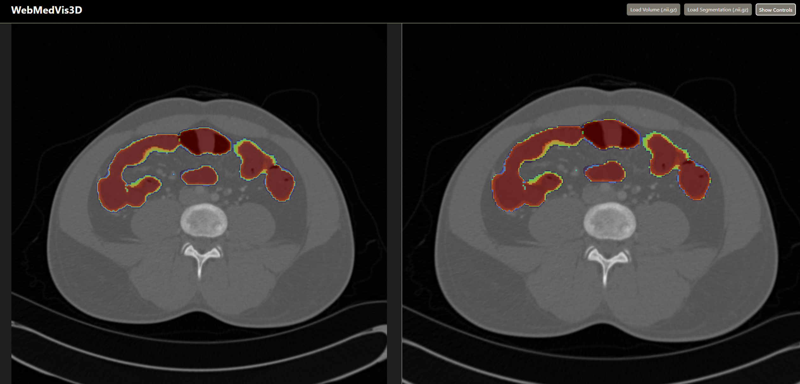
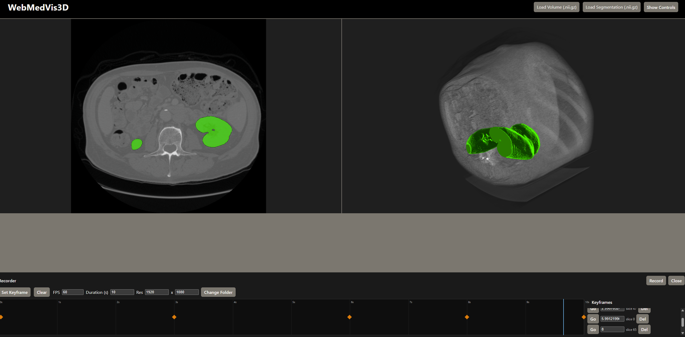

## [WebMedVis3D](https://medvis3d.web.app/)

An in-browser medical volume and segmentation viewer for NIfTI datasets with 2D and 3D visualization, probabilistic & binary segmentation overlays, label selection, and performance-aware rendering. All processing happens client‑side.

### Features

- **2D axial slice viewer (VTK)**
  - Mouse wheel to navigate slices.
  - Fixed window/level to dataset range; drag interactions for window/level are disabled to avoid accidental changes.
  - **Overlay support**:
    - Probabilistic overlay: color by value (turbo colormap), constant opacity with zero kept fully transparent.
    - Binary/discrete overlay: green mask (values > 0), opacity controlled by slider.
  - Independent opacity sliders for CT volume and overlay.
- **3D volume rendering (VTK)**
  - Volume rendering for CT and segmentation (composite blending).
  - Optional axial slice plane with optional segmentation overlay on the slice.
  - Trackball camera interaction for orbit/pan/zoom.
  - Depth-peeling/translucent ordering tuned for quality (auto-adjusted in performance mode).
  - Default camera tween to an axial view; Reset restores that exact view.
- **Segmentation rendering**
  - Load a segmentation `.nii` or `.nii.gz`, then choose:
    - **Probabilistic**: scalar values expected in [0, 1] (0 transparent; > 0 visible).
      - If values look like 0..255 bytes, they are normalized to 0..1.
    - **Discrete labels**: integer labels (0 assumed background).
      - Unique labels are extracted (up to 256) and listed; toggle which labels to include.
      - A binary mask is built from the selected labels.
  - Segmentation dimensions must match the CT volume.
- **Controls panel**
  - Toggle 2D and 3D views independently.
  - Slice index slider (+ wheel support).
  - Opacity sliders for 2D/3D volume and 2D/3D overlay.
  - Toggle the axial slice plane in 3D.
  - Toggle “Probabilistic label” for the loaded segmentation (reloads using the chosen mode).
  - “Reset View” resets cameras (2D and 3D) to defaults.
- **Recording Panel**
  - Create keyframe-based camera and slice animations.
  - Render the camera view as it moves through keyframes as a series of frames.
  - Use for generating beautiful 3D movie renderings of segmentations and volumes.
- **Performance-aware rendering**
  - “High performance” toggle:
    - During camera interaction: increases sample distance and reduces render size for smoother motion.
    - When idle: returns to a high-quality configuration automatically.
- **Privacy**
  - Files are processed locally in your browser; nothing is uploaded to a server.
- **Animated favicon**
  - A small heart animation plays in the browser tab.

---

### Screenshots and Animations

Below are short animations and screenshots showcasing the UI and rendering capabilities. Assets live under `public/paper-assets/` so they work locally and on the web.

---


_Figure 1: 2D and 3D slice viewers with probabilistic segmentation overlay of the intestinal tract. Cooler (blue) values indicate probabilities near 0; warmer (red) values indicate probabilities near 1._
---


_Figure 2: 3D volume rendering with segmentation and an axial slice plane; kidney segmentations._
---


_Figure 3: Probabilistic intestinal tract segmentation; cooler (blue) values near 0 and warmer (red) values near 1._
---


_Figure 4: Binary label for a liver segmentation._
---


_Figure 5: Binary label showing the intestinal tract in a coronal view. Red: colon (large intestine); blue: small intestine; green: duodenum._
---

### Supported input and constraints

- **Formats**: NIfTI `.nii` and `.nii.gz`.
- **Volume**
  - Dimensions and spacing are read from `dims` and `pixDims`.
  - Window/level is fixed to the dataset’s scalar min/max.
- **Segmentation**
  - Must have the exact same grid (dimensions) as the volume; mismatches show an alert.
  - Two modes:
    - **Probabilistic**: expected values in [0, 1]; out-of-range values are clamped; byte-like [0..255] normalized to [0..1].
    - **Discrete labels**: integer labels; 0 is treated as background; other integers treated as separate classes.
  - In discrete mode, up to 256 unique labels are enumerated and can be toggled to build a binary mask.

Limitations:
- Orientation matrices (qform/sform) are not applied; data is visualized in native grid order.
- No resampling is performed; segmentation must already be aligned and on the same grid.
- DICOM is not supported; convert to NIfTI beforehand.

---

### Getting started

- **Requirements**
  - Node.js 18+ (Node 20 recommended), npm 9+.
  - A modern desktop browser with WebGL support (Chrome, Edge, Firefox recommended).  Safari not recommended.
  - GPU acceleration enabled.

- **Install**
```bash
npm install
```

- **Run locally**
```bash
npm run dev
```
Open the printed local URL in your browser.

- **Build for production**
```bash
npm run build
```

- **Preview the production build**
```bash
npm run preview
```

- **Lint**
```bash
npm run lint
```

---

### Using the app

1. **Load a CT volume**
   - Click “Load Volume (.nii.gz)” and select a `.nii` or `.nii.gz` file.
   - The axial slice view appears; scroll the mouse wheel over the 2D view to move through slices.

2. **Load a segmentation (optional)**
   - Click “Load Segmentation (.nii.gz)” and select the segmentation file.
   - Choose “Probabilistic (Values in [0, 1])” or “Discrete Labels (Integers)” in the modal, then click “Load”.
   - If discrete, a list of labels appears in the Controls; toggle labels to include/exclude them from the mask.

3. **Open the Controls**
   - Click “Show Controls” to reveal the panel:
     - **Index**: set current slice; you can also use the mouse wheel over the 2D view.
     - **2D View**:
       - Volume opacity.
       - Segmentation opacity (if loaded).
     - **3D View**:
       - Volume opacity.
       - Segmentation opacity (if loaded).
       - Toggles:
         - **High performance**: adaptive quality during interaction.
         - **Slice in 3D**: show the current axial slice plane; if a segmentation is present, an overlaid slice is also shown.
         - **Probabilistic label**: switch how the segmentation is interpreted; the segmentation file is reloaded in the chosen mode.
     - **Labels** (discrete only): choose which label indices are visible.
     - **Reset View**: restores the default cameras (2D and 3D).

4. **Navigate and interact**
   - **2D**: mouse wheel to change slices. Left-drag window/level is intentionally disabled.
   - **3D** (trackball camera):
     - Left-drag: orbit
     - Right-drag or Ctrl/Cmd-drag: pan
     - Scroll: zoom

5. **Tips for performance**
   - Enable “High performance” in Controls.
   - Hide the 3D view when not needed.
   - Reduce browser window size.
   - Prefer moderate volume sizes and avoid extremely large grids.

---

### Recording panel

Create keyframe-based camera and slice animations and export frames to disk.

- Open: In `Controls`, click `Open Recorder` to toggle the panel at the bottom.
- Set up: Choose FPS, Duration, and Resolution, then click `Choose Folder`.
  - Uses the File System Access API; requires Chrome or Edge on desktop. Unsupported browsers will show an alert.
- Keyframes:
  - Scrub the timeline (drag or mouse wheel), then position the 3D camera and slice and click `Set Keyframe`.
  - Drag the diamond markers to retime keyframes. `Go` jumps to a keyframe; `Del` removes it.
- Record: Click `Record` to save a numbered TGA image sequence (`frame_00000.tga`, `frame_00001.tga`, …) into the selected folder. Alpha is preserved.
- Make a video (optional):
  - Example with ffmpeg:
    ```bash
    ffmpeg -framerate 30 -i frame_%05d.tga -pix_fmt yuv420p -crf 18 out.mp4
    ```

Notes:
- Frames are written directly to disk to keep memory usage low.
- Large resolutions or long durations will produce many files; ensure sufficient disk space.

---

### Visual mapping details

- **Volume (CT)**
  - 2D slice uses the volume’s scalar range for window/level and a user-set opacity.
  - 3D uses a grayscale color transfer function with scalar-opacity proportional to volume opacity.

- **Segmentation overlay**
  - Zero is fully transparent in both 2D and 3D.
  - Non-zero values:
    - **Probabilistic**:
      - Color: turbo colormap as a function of voxel value.
      - Opacity: globally controlled by the overlay slider; constant for values > 0.
    - **Discrete (binary mask built from selected labels)**:
      - Color: green.
      - Opacity: globally controlled by the overlay slider.

- **3D slice overlays**
  - If “Slice in 3D” is enabled, the app renders the axial slice with the segmentation overlaid, keeping the overlay slightly offset toward the camera to avoid z-fighting.

---

### Project structure

- `src/App.tsx`: App layout, file upload handlers, state, and feature wiring.
- `src/components/Volume2DView.tsx`: 2D slice rendering with overlay.
- `src/components/Volume3DView.tsx`: 3D volume rendering, slice plane, interaction-aware quality.
- `src/components/Controls.tsx`: UI for slice, opacities, toggles, label selection, reset.
- `src/utils/nifti.ts`: Read and scale NIfTI, label utilities, normalization helpers.
- `src/utils/vtkImage.ts`: Convert `VolumeData` to `vtkImageData`.
- `src/utils/favicon.ts`: Heartbeat favicon animation.
- `src/types.ts`: Shared types.
- `index.html`, `src/main.tsx`: App bootstrap.

---

### Troubleshooting

- **“Segmentation dimensions do not match volume.”**
  - Ensure the segmentation was produced on the exact same grid as the CT volume (same `dims` and `pixDims`).
- **Nothing shows up / black screen**
  - Verify WebGL is enabled in your browser.
  - Try another browser (Chrome or Edge).
- **Overlay looks wrong**
  - Confirm you chose the correct mode (Probabilistic vs Discrete).
  - For discrete, verify expected label indices and toggles.
- **Orientation appears unexpected**
  - Orientation matrices are not applied; data is visualized in native grid order.
- **Very large volumes are slow or crash**
  - Use the “High performance” toggle, reduce window size, and consider smaller volumes.

---

### Acknowledgements

- **VTK.js** (`@kitware/vtk.js`, `vtk.js`) for rendering.
- **nifti-reader-js** for NIfTI parsing.
- **pako** for gzip decompression.
- **React** and **Vite** for the web app framework and tooling.
- Additional deps in `package.json`.

---
